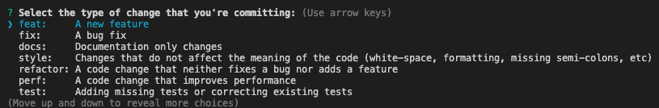

# Express Services

## Introduction

This is an example repo using the express framework for building backend api services.

## Running all services locally

In the root folder run the following commands:
`npm i`
`npm run start`

## Commiting changes

To commit changes run the following `npm run commit` which will run commitizen as shown below:

## Running all unit tests & linting

In the root folder run the following command:

`npm run test`

optionally to watch the changes you can run the following:

`npm run test:watch`

You can run the linting with the folllowing command:

`npm run lint`

## Creating a release

To create a release and update the changelog file you run the following scripts:

`npm run release:major` - this will bump the version and tag the major version release.
`npm run release:minor` - this will bump the version and tag the minor version release.
`npm run release:patch` - this will bump the version and tag the patch version release.

> Note: To generate the first release you must run the following: `npm run release -- --first-release`

## Generating documentation

In the root folder run the following command to generate the documentation for all packages and services using tsdoc:

`npm run docs`

## Generating Open API documentation

In the root folder run the following command to generate the Open API documentation for all packages and services:

`npm run openapi`

## Style linting

In the root folder run the following command to ensure style lint is ran across all typescript code:

`npm run prettier`

## Running load/e2e tests

In the root folder run the following commands to ensure the endpoints pass the e2e/load tests:

`npm run start` # ensure that the local services are running before running the second command.

`npm run e2e`
